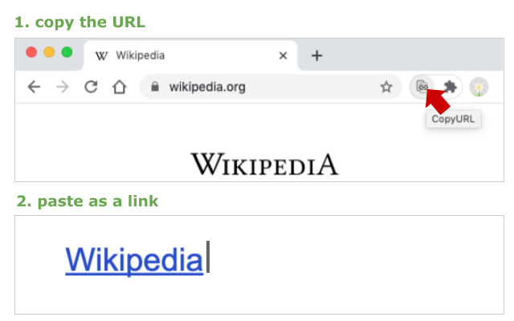

#  CopyURL

CopyURL is a [Chrome Extension](https://chromewebstore.google.com/detail/copyurl/jghibnldpjddbfolfkfongaklfidaafd) to copy the URL and title of the active page.

You can copy the URL and the title of the page in rich-text by clicking the extension icon.

If the application does not support rich-text, the title and URL are pasted in plain text.
